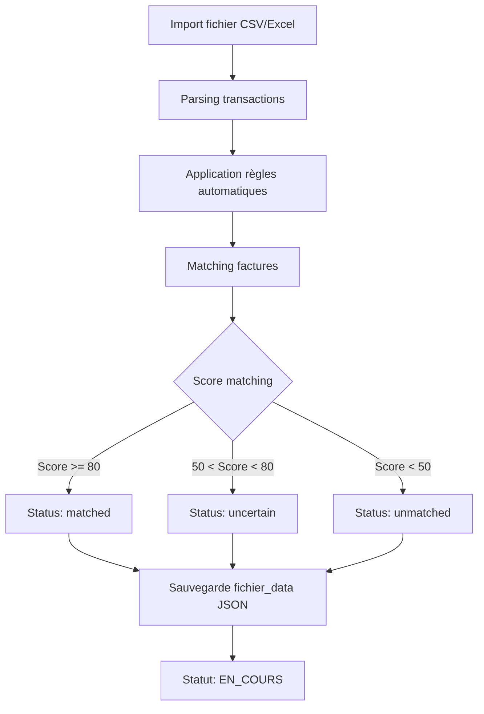

# Documentation Système de Rapprochement Bancaire

## 📋 Vue d'ensemble

Le système de rapprochement bancaire permet de lier automatiquement ou manuellement les transactions bancaires avec:
- **Factures de ventes** (VENTES)
- **Factures d'achats** (ACHATS)
- **Paiements d'abonnements** (abonnements partenaires)
- **Déclarations de charges sociales**

Le processus comporte deux phases:
1. **En cours**: Fichier de rapprochement en édition (statut `EN_COURS`)
2. **Historique**: Fichier validé et définitif (statut `VALIDE`)

---

## 🗄️ Tables de la base de données

### Tables principales

#### 1. `fichiers_rapprochement`
Stocke les fichiers de rapprochement importés depuis la banque.
- `id` (UUID)
- `numero_rapprochement` (ex: RAP-2412-01) - **Clé d'identification**
- `date_debut`, `date_fin` - Période couverte
- `fichier_data` (JSONB) - Contient toutes les transactions et rapprochements
- `statut` (`EN_COURS` | `VALIDE`)
- `total_lignes`, `lignes_rapprochees` - Statistiques
- `created_by`, `created_at`, `updated_at`

**Structure du `fichier_data` (JSONB):**
```json
{
  "rapprochements": [
    {
      "transaction": {
        "date": "2024-12-15",
        "libelle": "VIR SEPA CLIENT XYZ",
        "debit": 0,
        "credit": 1500.50,
        "montant": 1500.50
      },
      "facture": { /* données facture */ },
      "factureIds": ["uuid1", "uuid2"],  // Support multi-factures
      "factures": [ /* liste factures */ ],
      "score": 95,
      "status": "matched" | "unmatched" | "uncertain" | "partial",
      "notes": "...",
      "numero_ligne": "RL-20241215-12345"  // ⭐ Identifiant unique de ligne
    }
  ],
  "rapprochementsManuels": [ /* même structure */ ]
}
```

#### 2. `factures`
Stocke toutes les factures (ventes et achats).
- `id` (UUID)
- `numero_facture` (ex: FAC-V-2024-00123)
- `type_facture` (`VENTES` | `ACHATS`)
- `date_emission`, `date_echeance`
- `emetteur_type`, `emetteur_id`, `emetteur_nom`, `emetteur_adresse`...
- `destinataire_type`, `destinataire_id`, `destinataire_nom`...
- `total_ht`, `total_tva`, `total_ttc`
- `statut` (`BROUILLON` | `VALIDEE` | `PAYEE` | `ANNULEE`)
- **`numero_rapprochement`** - Référence au fichier de rapprochement
- **`numero_ligne_rapprochement`** - ⭐ **Référence au numéro de ligne** (ex: RL-20241215-12345)
- `date_rapprochement`
- `created_by`, `created_at`, `updated_at`

#### 3. `facture_lignes`
Détail des lignes de factures.
- `id`, `facture_id`
- `ordre`, `description`
- `quantite`, `prix_unitaire_ht`, `prix_ht`
- `taux_tva`, `montant_tva`, `prix_ttc`

#### 4. `rapprochements_bancaires`
Table des rapprochements manuels (historique uniquement).
- `id` (UUID)
- `transaction_date`, `transaction_libelle`, `transaction_montant`
- `transaction_debit`, `transaction_credit`
- `facture_id` - ⚠️ **OBSOLÈTE** (utiliser `rapprochements_factures`)
- `abonnement_id` - Lien vers un abonnement
- `declaration_charge_id` - Lien vers une déclaration
- `notes`
- `numero_ligne` - ⭐ Identifiant de ligne (ex: RL-20241215-12345)
- `created_by`, `created_at`, `updated_at`

#### 5. `rapprochements_factures` ⭐ **Table de jonction (N-N)**
Permet d'associer **plusieurs factures à un rapprochement**.
- `id` (UUID)
- `rapprochement_id` → `rapprochements_bancaires.id`
- `facture_id` → `factures.id`
- `created_by`, `created_at`

**Usage:**
```sql
-- Associer plusieurs factures à un rapprochement
INSERT INTO rapprochements_factures (rapprochement_id, facture_id)
VALUES 
  ('rappr-123', 'facture-1'),
  ('rappr-123', 'facture-2');
```

#### 6. `abonnements_partenaires`
Abonnements récurrents (assurances, loyers, etc.).
- `id`, `nom`, `nature` (`ASSURANCE` | `LOA_VOITURE` | `LOYER`...)
- `montant_mensuel`, `jour_prelevement`
- `actif`, `notes`
- `document_url`

#### 7. `paiements_abonnements`
Historique des paiements d'abonnements.
- `id`, `abonnement_id`
- `rapprochement_id` → `rapprochements_bancaires.id`
- `date_paiement`, `montant`, `notes`

#### 8. `abonnements_consommations`
Détail des consommations liées à un abonnement.
- `id`, `abonnement_id`, `rapprochement_id`
- `date_consommation`, `montant`, `libelle`, `description`

#### 9. `declarations_charges_sociales`
Déclarations récurrentes de charges.
- `id`, `nom`, `organisme`
- `type_charge` (`SALAIRE` | `CHARGES_SOCIALES` | `RETRAITE` | `MUTUELLE`)
- `periodicite` (`MENSUEL` | `TRIMESTRIEL` | `ANNUEL`)
- `montant_estime`, `jour_echeance`
- `actif`, `notes`

#### 10. `paiements_declarations_charges`
Historique des paiements de déclarations.
- `id`, `declaration_charge_id`
- `rapprochement_id` → `rapprochements_bancaires.id`
- `date_paiement`, `montant`, `notes`

#### 11. `regles_rapprochement`
Règles automatiques de rapprochement.
- `id`, `nom`, `type_regle`
- `condition_json` (JSONB) - Conditions de matching
- `score_attribue` (0-100)
- `priorite`, `actif`

### Tables de séquences

#### `rapprochement_sequences`
Génération des numéros de rapprochement.
- `year` (PK)
- `last_number`

**Format généré:** `RAP-YYMM-NN` (ex: RAP-2412-01)

---

## 📁 Composants et Pages

### Pages principales

#### 1. `src/pages/RapprochementBancaire.tsx`
**Page centrale du système de rapprochement.**

**Fonctionnalités:**
- Import de fichiers bancaires (CSV/Excel)
- Analyse et matching automatique (via règles)
- Gestion des rapprochements en cours (`EN_COURS`)
- Gestion de l'historique validé (`VALIDE`)
- Validation finale du rapprochement

**Onglets:**
- **En cours**: Fichiers non validés, édition possible
- **Historique**: Fichiers validés, lecture seule (sauf édition manuelle)

**États clés:**
```typescript
interface Rapprochement {
  transaction: TransactionBancaire;
  facture: FactureMatch | null;
  factureIds?: string[];  // Support multi-factures
  factures?: FactureMatch[];
  score: number;
  status: "matched" | "unmatched" | "uncertain" | "partial";
  isManual?: boolean;
  manualId?: string;
  notes?: string;
  numero_ligne?: string;  // ⭐ Identifiant unique
}
```

**Actions principales:**
- `handleImportFile()` - Import fichier bancaire
- `handleValidateRapprochement()` - Validation finale (EN_COURS → VALIDE)
- `handleDeleteFichier()` - Suppression fichier en cours

#### 2. `src/pages/FacturesVentes.tsx`
Gestion des factures de ventes.

**Colonnes importantes:**
- `numero_facture`, `date_emission`, `destinataire_nom` (client)
- `total_ht`, `total_ttc`, `statut`
- **`numero_rapprochement`** - Badge si rapproché

**Actions:**
- Création, édition, suppression
- Copie de facture
- Téléchargement PDF (multi-sélection)

#### 3. `src/pages/FacturesAchats.tsx`
Gestion des factures d'achats.

**Spécificités:**
- Extraction AI via fichier PDF
- Détection fournisseurs existants
- **Bouton "Voir rapprochement"** si `numero_rapprochement` existe
  - Ouvre `FactureRapprochementDialog`

#### 4. `src/pages/PaiementsAbonnements.tsx`
**Vue en lecture seule** des paiements d'abonnements issus des rapprochements.

**Affichage:**
- Date, abonnement, nature, montant
- Rapprochement associé (libellé)
- Notes

#### 5. `src/pages/DeclarationsChargesSociales.tsx`
Gestion des déclarations récurrentes de charges.

**Fonctionnalités:**
- Création/édition/suppression de déclarations
- Activation/désactivation
- Configuration: nom, organisme, type, périodicité, montant estimé, jour d'échéance

---

### Composants (Dialogs)

#### 1. `EditRapprochementEnCoursDialog.tsx`
**Édition d'un rapprochement EN COURS.**

**Fonction:** Modifier le statut et les associations **avant validation**.

**Inputs:**
- Statut: `matched` | `unmatched` | `uncertain`
- **Factures associées** (multi-sélection ventes/achats)
- Notes

**Workflow:**
1. Ouverture depuis liste "En cours"
2. Modification des associations
3. Enregistrement dans `fichier_data` (JSON)
4. ⚠️ **Pas d'écriture en BDD** (uniquement JSON)

#### 2. `EditRapprochementHistoriqueDialog.tsx`
**Édition d'un rapprochement VALIDÉ (historique).**

**Fonction:** Modifier un rapprochement déjà validé.

**Inputs:**
- **Factures associées** (multi-sélection)
- Abonnement (optionnel)
  - Si sélectionné: champs consommations multiples
- Déclaration de charges (optionnel)
- Notes

**Workflow:**
1. Ouverture depuis liste "Historique"
2. Modification
3. **Écriture en BDD:**
   - `rapprochements_bancaires` (update/insert)
   - `rapprochements_factures` (delete ancien + insert nouveaux)
   - `paiements_abonnements` (si abonnement sélectionné)
   - `abonnements_consommations` (si consommations)
   - `paiements_declarations_charges` (si déclaration)
4. Mise à jour `fichier_data` (JSON)

#### 3. `RapprochementManuelDialog.tsx`
**Création d'un rapprochement manuel.**

**Usage:** Rapprocher manuellement une transaction non matchée.

**Inputs:**
- **Factures** (multi-sélection ventes/achats)
- **OU** Abonnement + consommations
- **OU** Déclaration de charges
- Notes

**Workflow:**
1. Ouverture depuis bouton "Rapprochement manuel" (en cours)
2. Sélection
3. **Écriture en BDD:**
   - `rapprochements_bancaires`
   - `rapprochements_factures`
   - `paiements_abonnements` / `abonnements_consommations`
   - `paiements_declarations_charges`
4. Ajout dans `fichier_data.rapprochementsManuels`

#### 4. `FactureRapprochementDialog.tsx`
**Affichage du détail d'un rapprochement pour une facture.**

**Usage:** 
- Depuis `FacturesAchats.tsx` ou `FacturesVentes.tsx`
- Clic sur badge "Rapprochement" ou bouton "Détails"

**Affichage:**
- **N° Ligne transaction** (ex: RL-20241215-12345) ⭐
- Date, libellé, montant (débit/crédit)
- **Toutes les factures associées à cette ligne**
  - Numéro, montant TTC, type (vente/achat)
  - **TVA totale agrégée** de toutes les factures
- Notes

**Action:**
- **Annuler le rapprochement** (bouton rouge)
  - Dé-rapproche **TOUTES** les factures de la ligne
  - Met à jour `fichier_data` (status → `partial`)
  - Réinitialise `factures.numero_rapprochement` et `numero_ligne_rapprochement`

#### 5. `AddRegleRapprochementDialog.tsx` / `EditRegleRapprochementDialog.tsx`
**Gestion des règles automatiques.**

**Types de règles:**
- `MONTANT` - Correspondance de montant
- `DATE` - Correspondance de date
- `LIBELLE` - Mots-clés dans le libellé
- `TYPE_TRANSACTION` - Débit/crédit
- `PARTENAIRE` - Nom du partenaire
- `ABONNEMENT` - Abonnement spécifique + keywords
- `DECLARATION_CHARGE` - Déclaration spécifique + keywords
- `PERSONNALISEE` - JSON libre

**Champs:**
- Nom, type, description
- `condition_json` (JSONB)
- Score attribué (0-100)
- Priorité (ordre d'application)

**Exemple règle abonnement:**
```json
{
  "abonnement_id": "uuid-abo-123",
  "keywords": ["MMA IARD", "2456510036320241226526059501"]
}
```

---

## 🔄 Flux de travail complet

### Phase 1: Import et analyse (EN_COURS)



**Code clé:**
```typescript
// RapprochementBancaire.tsx - handleValidateRapprochement()

// 1. Générer un numero_ligne unique pour chaque rapprochement
const numeroLigne = `RL-${format(new Date(transaction.date), 'yyyyMMdd')}-${Math.random().toString(36).substr(2, 9).toUpperCase()}`;

// 2. Stocker dans fichier_data
rapprochement.numero_ligne = numeroLigne;

// 3. Créer rapprochement_bancaires si manuel
if (rapprochement.isManual) {
  const { data: rapprBancaire } = await supabase
    .from('rapprochements_bancaires')
    .insert({
      transaction_date: transaction.date,
      transaction_libelle: transaction.libelle,
      transaction_montant: transaction.montant,
      numero_ligne: numeroLigne,
      // ...
    })
    .select()
    .single();
    
  // 4. Associer les factures (table de jonction)
  if (rapprochement.factureIds?.length > 0) {
    await supabase
      .from('rapprochements_factures')
      .insert(
        rapprochement.factureIds.map(fId => ({
          rapprochement_id: rapprBancaire.id,
          facture_id: fId
        }))
      );
  }
}

// 5. Mettre à jour les factures avec numero_ligne_rapprochement
await supabase
  .from('factures')
  .update({
    statut: 'PAYEE',
    numero_rapprochement: numeroRapprochement,
    numero_ligne_rapprochement: numeroLigne,
    date_rapprochement: new Date().toISOString()
  })
  .in('id', factureIds);
```

### Phase 2: Édition en cours

**Actions possibles:**
1. **Modifier statut/associations** (`EditRapprochementEnCoursDialog`)
   - ✅ Modifications dans JSON uniquement
   - ❌ Pas de changement BDD

2. **Rapprochement manuel** (`RapprochementManuelDialog`)
   - ✅ Écriture immédiate en BDD
   - ✅ Ajout dans `rapprochementsManuels`

### Phase 3: Validation (EN_COURS → VALIDE)

```typescript
// handleValidateRapprochement()
await supabase
  .from('fichiers_rapprochement')
  .update({ 
    statut: 'VALIDE',
    updated_at: new Date().toISOString()
  })
  .eq('id', fichierId);

// Pour chaque rapprochement matched:
//   - Créer rapprochements_bancaires (si pas manuel)
//   - Créer rapprochements_factures (associations)
//   - Mettre à jour factures.numero_rapprochement + numero_ligne_rapprochement
//   - Créer paiements_abonnements (si abonnement)
//   - Créer paiements_declarations_charges (si déclaration)
```

**Résultat:**
- Fichier passe en `VALIDE` (lecture seule)
- Toutes les factures rapprochées ont:
  - `numero_rapprochement` (ex: RAP-2412-01)
  - `numero_ligne_rapprochement` (ex: RL-20241215-12345)
  - `statut` = `PAYEE`

### Phase 4: Historique et consultations

#### A. Depuis Factures (Achats/Ventes)

```typescript
// Affichage badge rapprochement
<Badge>{facture.numero_rapprochement}</Badge>

// Clic → FactureRapprochementDialog
// - Charge fichier_data via numero_rapprochement
// - Filtre sur numero_ligne_rapprochement
// - Affiche TOUTES les factures de cette ligne
```

**Code chargement:**
```typescript
// FactureRapprochementDialog.tsx - loadRapprochements()

// 1. Récupérer le numero_ligne_rapprochement de la facture
const { data: factureData } = await supabase
  .from('factures')
  .select('numero_rapprochement, numero_ligne_rapprochement')
  .eq('id', factureId)
  .single();

// 2. Charger le fichier de rapprochement
const { data: fichierData } = await supabase
  .from('fichiers_rapprochement')
  .select('fichier_data, numero_rapprochement')
  .eq('numero_rapprochement', factureData.numero_rapprochement)
  .single();

// 3. Trouver le rapprochement spécifique par numero_ligne
const allRapprochements = [
  ...(fichierData.fichier_data.rapprochements || []),
  ...(fichierData.fichier_data.rapprochementsManuels || [])
];

const rapprochementLigne = allRapprochements.find(
  item => item.numero_ligne === factureData.numero_ligne_rapprochement
);

// 4. Récupérer TOUTES les factures associées à cette ligne
const { data: facturesAssociees } = await supabase
  .from('factures')
  .select('numero_facture, total_ttc, total_tva, type_facture')
  .eq('numero_ligne_rapprochement', factureData.numero_ligne_rapprochement);

// 5. Calculer la TVA totale
const totalTva = facturesAssociees.reduce((sum, f) => sum + f.total_tva, 0);
```

#### B. Annulation d'un rapprochement

```typescript
// FactureRapprochementDialog.tsx - handleUnlink()

// 1. Récupérer toutes les factures de cette ligne
const { data: facturesAssociees } = await supabase
  .from('factures')
  .select('id, numero_rapprochement')
  .eq('numero_ligne_rapprochement', numeroLigne);

// 2. Charger le fichier et modifier le JSON
const { data: fichierData } = await supabase
  .from('fichiers_rapprochement')
  .select('id, fichier_data')
  .eq('numero_rapprochement', numeroRapprochement)
  .single();

// 3. Mettre la ligne en "partial" (plus rapprochée)
const updatedRapprochements = fichierData.fichier_data.rapprochements.map(item => {
  if (item.numero_ligne === numeroLigne) {
    return {
      ...item,
      facture: undefined,
      factureIds: undefined,
      factures: undefined,
      status: 'partial'
    };
  }
  return item;
});

// 4. Sauvegarder le fichier modifié
await supabase
  .from('fichiers_rapprochement')
  .update({ fichier_data: { ...fichierData.fichier_data, rapprochements: updatedRapprochements } })
  .eq('id', fichierData.id);

// 5. Dé-rapprocher TOUTES les factures
await supabase
  .from('factures')
  .update({
    statut: 'VALIDEE',
    numero_rapprochement: null,
    numero_ligne_rapprochement: null,
    date_rapprochement: null
  })
  .eq('numero_ligne_rapprochement', numeroLigne);
```

#### C. Depuis Historique (lecture seule + édition manuelle)

**Vue liste historique:**
- Fichiers validés (`VALIDE`)
- Clic sur ligne → `EditRapprochementHistoriqueDialog`
- Modification possible (écrit en BDD + JSON)

---

## 🔑 Points clés du système

### 1. **Numérotation et traçabilité**

| Élément | Format | Exemple | Portée |
|---------|--------|---------|--------|
| Fichier rapprochement | `RAP-YYMM-NN` | RAP-2412-01 | Fichier entier |
| Ligne de transaction | `RL-YYYYMMDD-XXXXX` | RL-20241215-A3B9K | Une transaction + ses factures |
| Facture | `FAC-V-YYYY-NNNNN` | FAC-V-2024-00123 | Une facture |

### 2. **Support multi-factures**

✅ **Une transaction peut être liée à plusieurs factures.**

**Implémentation:**
- `fichier_data.rapprochements[].factureIds` (array)
- `fichier_data.rapprochements[].factures` (array)
- Table `rapprochements_factures` (N-N)
- `factures.numero_ligne_rapprochement` (lien)

**Utilité:**
- Regrouper plusieurs factures pour un même paiement
- Calcul TVA agrégée
- Gestion des acomptes/soldes

### 3. **Statuts des rapprochements**

| Statut | Description | Actions possibles |
|--------|-------------|-------------------|
| `matched` | Rapproché avec succès (score >= 80) | Édition, validation |
| `uncertain` | Rapprochement incertain (50-79) | Validation manuelle requise |
| `unmatched` | Non rapproché (< 50) | Rapprochement manuel |
| `partial` | Partiellement rapproché (après dé-rapprochement) | Édition |

### 4. **Règles de matching**

**Ordre d'application:**
1. Règles triées par `priorite` (ASC)
2. Application séquentielle
3. Cumul des scores
4. Prise de décision selon score final

**Types de règles:**
- **ABONNEMENT**: Détection automatique via keywords + liaison paiement
- **DECLARATION_CHARGE**: Détection charges sociales + paiement
- **MONTANT/DATE/LIBELLE**: Matching classique
- **PERSONNALISEE**: JSON libre

### 5. **Données JSON vs BDD**

| Phase | Fichier JSON | Base de données |
|-------|--------------|-----------------|
| **EN_COURS** | ✅ Modifications | ❌ Pas d'écriture (sauf manuels) |
| **Validation** | ✅ Lecture | ✅ Écriture massive |
| **VALIDE** | ✅ Source de vérité | ✅ Exploitation factures/paiements |
| **Édition historique** | ✅ Mise à jour | ✅ Modification BDD |

### 6. **Flux des paiements**

```
Transaction bancaire
    ↓
Rapprochement (fichier_rapprochement.fichier_data)
    ↓
    ├─→ Factures (factures.numero_ligne_rapprochement)
    ├─→ Abonnement → paiements_abonnements + abonnements_consommations
    └─→ Déclaration → paiements_declarations_charges
```

---

## 📊 Requêtes SQL utiles

### Factures rapprochées pour un fichier

```sql
SELECT 
  f.numero_facture,
  f.type_facture,
  f.total_ttc,
  f.numero_ligne_rapprochement,
  f.numero_rapprochement
FROM factures f
WHERE f.numero_rapprochement = 'RAP-2412-01'
ORDER BY f.numero_ligne_rapprochement, f.date_emission;
```

### Toutes les factures d'une ligne de transaction

```sql
SELECT 
  f.numero_facture,
  f.type_facture,
  f.total_ttc,
  f.total_tva,
  f.date_emission,
  f.emetteur_nom,
  f.destinataire_nom
FROM factures f
WHERE f.numero_ligne_rapprochement = 'RL-20241215-A3B9K';

-- Avec total TVA agrégé
SELECT 
  COUNT(*) as nb_factures,
  SUM(f.total_ttc) as total_ttc,
  SUM(f.total_tva) as total_tva
FROM factures f
WHERE f.numero_ligne_rapprochement = 'RL-20241215-A3B9K';
```

### Paiements d'abonnements

```sql
SELECT 
  p.date_paiement,
  p.montant,
  a.nom as abonnement,
  a.nature,
  rb.transaction_libelle,
  rb.numero_ligne
FROM paiements_abonnements p
JOIN abonnements_partenaires a ON p.abonnement_id = a.id
LEFT JOIN rapprochements_bancaires rb ON p.rapprochement_id = rb.id
ORDER BY p.date_paiement DESC;
```

### Consommations d'un abonnement

```sql
SELECT 
  c.date_consommation,
  c.libelle,
  c.montant,
  c.description,
  rb.transaction_libelle,
  rb.numero_ligne
FROM abonnements_consommations c
LEFT JOIN rapprochements_bancaires rb ON c.rapprochement_id = rb.id
WHERE c.abonnement_id = 'uuid-abo-123'
ORDER BY c.date_consommation DESC;
```

### Factures multiples sur un rapprochement

```sql
SELECT 
  rf.rapprochement_id,
  rb.transaction_libelle,
  rb.transaction_montant,
  rb.numero_ligne,
  COUNT(rf.facture_id) as nb_factures,
  ARRAY_AGG(f.numero_facture) as factures,
  SUM(f.total_ttc) as total_factures
FROM rapprochements_factures rf
JOIN rapprochements_bancaires rb ON rf.rapprochement_id = rb.id
JOIN factures f ON rf.facture_id = f.id
GROUP BY rf.rapprochement_id, rb.transaction_libelle, rb.transaction_montant, rb.numero_ligne
HAVING COUNT(rf.facture_id) > 1;
```

---

## 🐛 Dépannage

### Problème: Facture rapprochée mais pas visible dans historique

**Cause:** `numero_rapprochement` ou `numero_ligne_rapprochement` manquant.

**Solution:**
```sql
-- Vérifier
SELECT id, numero_facture, numero_rapprochement, numero_ligne_rapprochement
FROM factures
WHERE id = 'uuid-facture';

-- Réparer (si rapprochement connu)
UPDATE factures
SET 
  numero_rapprochement = 'RAP-2412-01',
  numero_ligne_rapprochement = 'RL-20241215-A3B9K',
  date_rapprochement = NOW()
WHERE id = 'uuid-facture';
```

### Problème: Paiement abonnement non créé

**Cause:** Erreur lors du rapprochement manuel ou validation.

**Solution:**
```sql
-- Créer manuellement
INSERT INTO paiements_abonnements (
  abonnement_id, 
  rapprochement_id, 
  date_paiement, 
  montant, 
  notes
)
VALUES (
  'uuid-abo',
  'uuid-rappr',
  '2024-12-15',
  150.00,
  'Créé manuellement'
);
```

### Problème: Incohérence JSON vs BDD

**Cause:** Modification manuelle BDD sans mise à jour du JSON.

**Solution:**
1. Recharger le fichier depuis la page Historique
2. Utiliser les dialogs d'édition (mettent à jour JSON + BDD)

---

## 🎯 Bonnes pratiques

1. **Toujours utiliser les dialogs fournis** pour les modifications (garantit cohérence JSON/BDD)
2. **Valider régulièrement** les fichiers en cours (pas d'accumulation)
3. **Documenter les rapprochements manuels** avec des notes claires
4. **Créer des règles** pour les transactions récurrentes
5. **Vérifier les totaux** avant validation (montant transaction = somme factures)
6. **Ne pas modifier directement** le `fichier_data` JSON en BDD

---

## 📈 Évolutions futures suggérées

1. **Export comptable** (FEC, Excel)
2. **Statistiques avancées** (taux de rapprochement, délais)
3. **Notifications** (échéances, anomalies)
4. **Import automatique** (API bancaire)
5. **Machine learning** (amélioration des règles)
6. **Rapprochement bancaire prévisionnel**
7. **Gestion des devises**

---

**Version:** 1.0  
**Date:** 2025-01-02  
**Auteur:** Documentation générée automatiquement